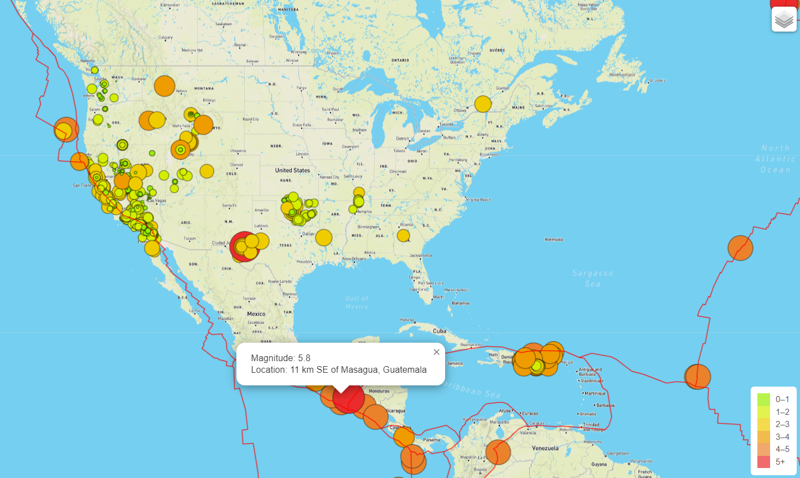

# Mapping_Earthquakes

Using JavaScript, Leaflet.js, and geoJSON data. 
Utilizing d3.json() & (geographical map) geoJSON() tectonic plate date was added.

Each earthquake can be seen as a certain colored circle, larger magnitude quakes will be bigger and darker.

Retrieve data from a GeoJSON file and make API requests host geographical maps --> populate geographical maps with GeoJSON data using JavaScript and (D3) library while adding multiple map layers using Leaflet!

